# Family Tree Application — Technical Architecture

> **Project:** Hamro Panchanga / Family Tree  
> **Last Updated:** April 2026  
> **Firebase Project ID:** `hamropanchanga`  
> **Firestore Database:** `hamropanchanga-db`

---

## Table of Contents

1. [Technology Stack](#1-technology-stack)
2. [System Architecture Overview](#2-system-architecture-overview)
3. [End-to-End Request Trace](#3-end-to-end-request-trace)
4. [Frontend Architecture](#4-frontend-architecture)
5. [Backend Architecture](#5-backend-architecture)
6. [Database Design](#6-database-design)
7. [Authentication & Role-Based Access Control](#7-authentication--role-based-access-control)
8. [Tithi Calculation Pipeline](#8-tithi-calculation-pipeline)
9. [Deployment Topology](#9-deployment-topology)
10. [Data Flow Diagrams](#10-data-flow-diagrams)

---

## 1. Technology Stack

### Frontend

| Technology | Version | Purpose |
|---|---|---|
| **React** | 18.3.1 | UI framework (Create React App) |
| **React Router DOM** | 7.10.1 | Client-side SPA routing |
| **Tailwind CSS** | 3.4.10 | Utility-first CSS framework |
| **PostCSS + Autoprefixer** | 8.5.6 | CSS build processing |
| **ReactFlow** | 11.11.4 | Interactive family tree graph visualization |
| **html-to-image** | 1.11.13 | Export tree as PNG/JPEG |
| **xlsx** | 0.18.5 | Excel import/export for bulk uploads |
| **astronomy-engine** | 2.1.19 | Moon/sun position calculations for Tithi |

### Backend / Infrastructure

| Technology | Version | Purpose |
|---|---|---|
| **Firebase SDK (client)** | 12.9.0 | Firestore, Auth, Storage access from browser |
| **Firebase Admin SDK** | 13.6.0 | Server-side Firestore + Auth in Cloud Functions |
| **Firebase Cloud Functions** | Node.js 20 runtime | Serverless backend, REST API host |
| **Express.js** | 4.18.2 | HTTP routing framework inside Cloud Functions |
| **CORS** | 2.8.5 | Cross-origin request middleware |

### Firebase Services

| Service | Role |
|---|---|
| **Firestore** | Primary NoSQL document database |
| **Firebase Authentication** | Google OAuth sign-in + custom JWT claims |
| **Firebase Hosting** | Static SPA hosting with catch-all SPA rewrite |
| **Firebase Cloud Storage** | Image hosting (home page cards) |
| **Firebase Cloud Functions** | REST API endpoints + callable functions |

### Localization & Domain

| Technology | Purpose |
|---|---|
| **Custom i18n (Context-based)** | Bilingual EN/NE with nested key translation |
| **Nepali Numeral Converter** | English ↔ Nepali digit conversion |
| **Custom BS Calendar Engine** | Bikram Sambat ↔ Gregorian (AD) date conversion |
| **Nepali Calendar Data** | Pre-computed BS year data for years 2000–2200 |

---

## 2. System Architecture Overview

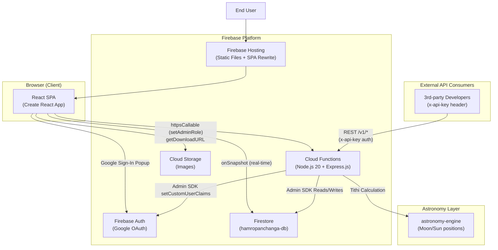

---

## 3. End-to-End Request Trace

This section traces every step that happens from the moment a user types `hamropanchanga.web.app` in the browser until the landing page is fully interactive with live data.

### Phase 1 — Network & Static Asset Delivery

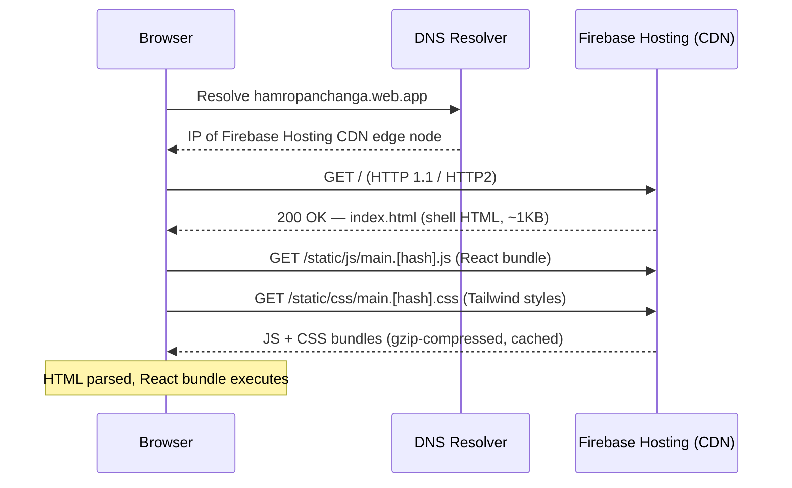

### Phase 2 — React Bootstrap & Auth Initialization

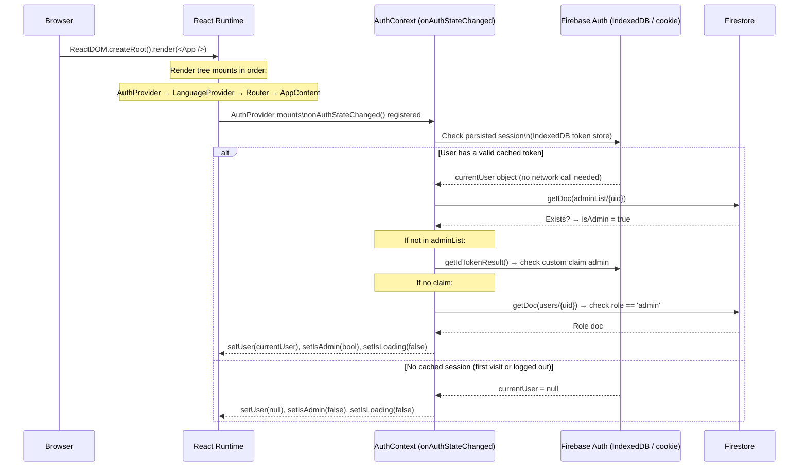

### Phase 3 — AppContent Renders & Firestore Subscriptions Open

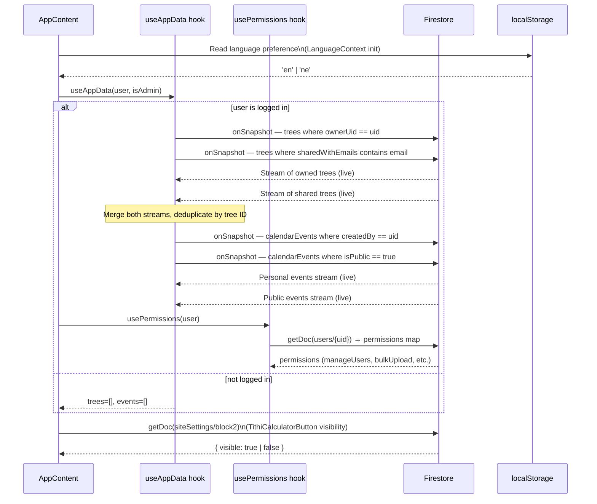

### Phase 4 — Landing Page Renders

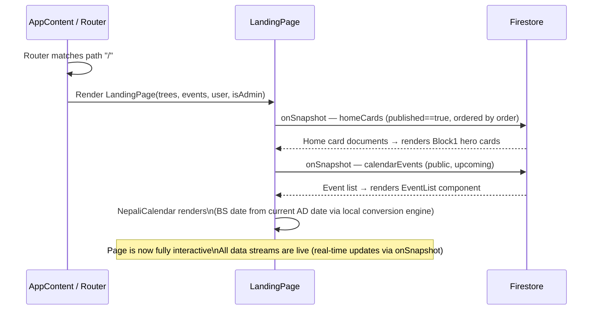

### Full Trace — Single Timeline

The entire sequence above, collapsed into one linear view:

```
User → hamropanchanga.web.app
    │
    ▼ [~50ms] DNS resolution → Firebase CDN edge node
    │
    ▼ [~100–300ms] HTTP GET / → Firebase Hosting returns index.html
    │
    ▼ [~200–600ms] Browser downloads & parses React JS + CSS bundles
    │
    ▼ [~5ms] ReactDOM.createRoot().render(<App />)
    │         AuthProvider mounts → onAuthStateChanged registered
    │         LanguageProvider reads localStorage ('en'|'ne')
    │         Router initializes → matches "/"
    │
    ├─► [~20–80ms] Firebase Auth checks IndexedDB for persisted session
    │         ├── Session EXISTS:
    │         │     → getDoc(adminList/{uid})           [Firestore read]
    │         │     → getIdTokenResult()                [local JWT decode]
    │         │     → getDoc(users/{uid})               [Firestore read, if needed]
    │         │     → setIsLoading(false), render unlocks
    │         └── No Session:
    │               → setUser(null), setIsLoading(false), render unlocks
    │
    ▼ [isLoading = false → AppContent fully renders]
    │
    ├─► useAppData hook opens Firestore onSnapshot listeners (if logged in):
    │       • trees (owned)
    │       • trees (shared)
    │       • calendarEvents (personal)
    │       • calendarEvents (public)
    │
    ├─► usePermissions fetches users/{uid} permissions (if logged in)
    │
    ├─► TithiCalculatorButton fetches siteSettings/block2
    │
    ▼ LandingPage renders:
        ├─► homeCards onSnapshot → hero section
        ├─► calendarEvents feed → event list
        └─► NepaliCalendar (pure local computation, no network)

    ✅ Page fully interactive with live real-time data
```

> **Key timing note:** On a returning user (cached session), the total time from URL to interactive page is typically **800ms – 1.5s**, dominated by the JS bundle download. On a first visit (cold cache + no session), DNS + auth check can add an extra **200–400ms**.

---

## 4. Frontend Architecture

### Route Map

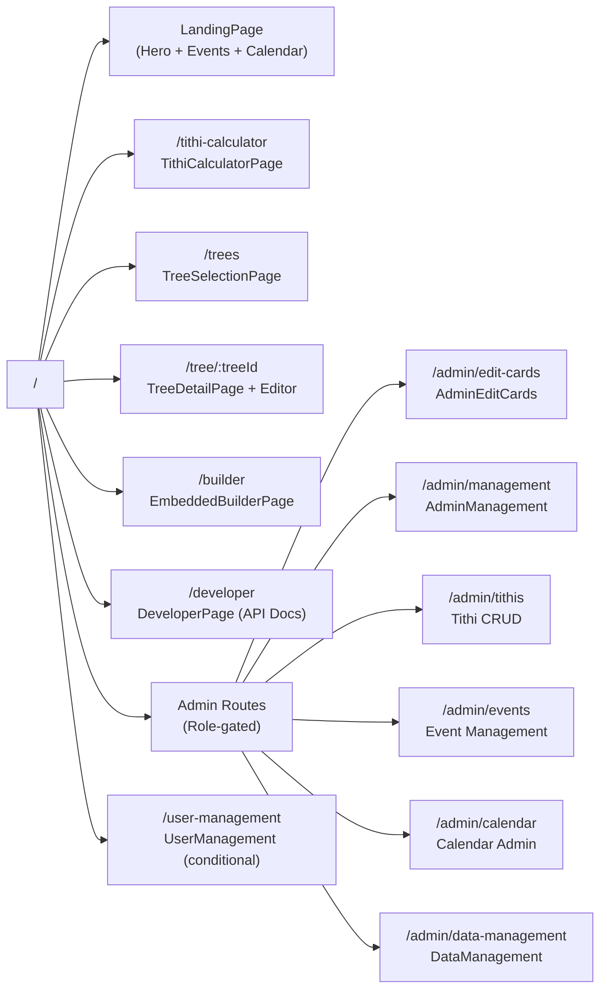

### State Management — Context Providers

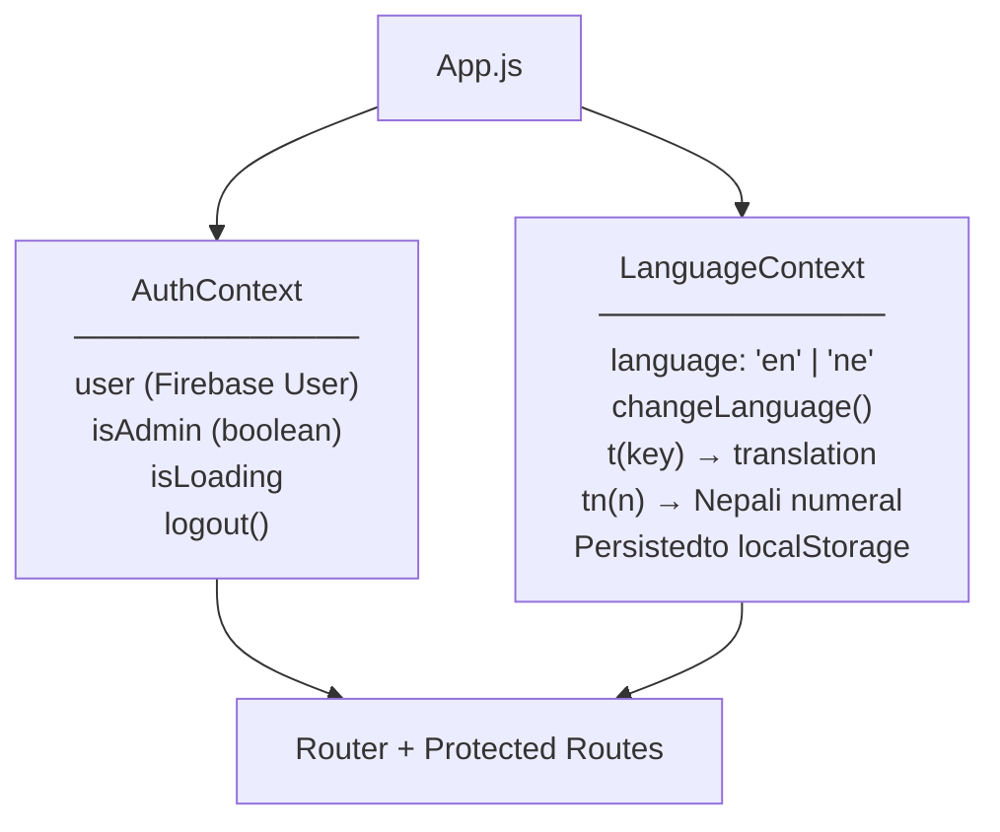

### Custom Hooks

| Hook | Subscriptions / Responsibility |
|---|---|
| `useAppData(user, isAdmin)` | Real-time: owned trees + shared trees + calendar events |
| `useCalendarEvents(user)` | Real-time: personal events + public events |
| `usePermissions(user)` | Reads `users/{uid}` permissions map |
| `useTithisData(startDate, endDate)` | Firestore range query on `tithis` collection |
| `useTithiDateResolver()` | Resolves BS dates for tithi display |
| `useInView()` | IntersectionObserver for lazy rendering |

### Component Layers

```
src/components/
├── LandingPage.js              ← Home (hero, events, calendar preview)
├── TithiCalculatorPage.js      ← Tithi lookup interface
├── DeveloperPage.js            ← Public REST API documentation
├── NepaliCalendar.js           ← Monthly calendar view
├── NepaliDatePicker.js         ← Date picker (BS dates)
├── NepaliCalendarManagement.js ← Admin: manage BS year data
├── EventList.js                ← Event feed component
├── AddEventForm.js             ← Event creation form
├── BulkUploadModal.js          ← Excel bulk tree import
├── TreeShareModal.js           ← Tree sharing dialog
├── UserManagement.js           ← Admin: user role management
├── DataManagement.js           ← Admin: data operations
├── LanguageSelector.js         ← EN / NE switcher
├── Toast.js                    ← Notification toasts
├── Admin/
│   ├── AdminCalendarPage.js
│   ├── AdminEditCards.js       ← Home card CMS
│   └── AdminManagement.js
└── TreeBuilder/
    ├── TreeBuilderPage.js      ← Main tree editor
    ├── TreeDetailPage.js       ← Tree read-only preview
    ├── TreeSelectionPage.js    ← Tree list / picker
    ├── EmbeddedBuilderPage.js  ← Embeddable tree editor
    ├── nodes/
    │   ├── FamilyNode.js       ← ReactFlow person node
    │   └── MarriagePointNode.js← ReactFlow marriage node
    ├── edges/
    │   └── (custom edge types)
    └── utils/
        └── (tree manipulation, import/export)
```

### Services

| Service | Responsibility |
|---|---|
| `adminExcelService.js` | Excel read/write for admin bulk data operations |
| `BulkUploadService.js` | Client-side validation for bulk tree Excel uploads |
| `CalendarEventService.js` | CRUD operations for calendar events (Firestore) |
| `apiKeyRequestService.js` | Submit / manage API key requests |

---

## 5. Backend Architecture

The backend is entirely **serverless**, running as a single Firebase Cloud Function (`api`) exposing an Express.js REST server.

### REST API (`/v1/*`)

Authentication: `x-api-key` header validated against hashed keys stored in the `apiKeys` Firestore collection.

| Method | Endpoint | Auth Required | Description |
|---|---|---|---|
| GET | `/v1/health` | No | Health check |
| GET | `/v1/calendar/:bsYear/:bsMonth` | API Key | Full Nepali month with AD dates + tithis |
| GET | `/v1/tithis` | API Key | Tithis in AD date range (`?startDate=&endDate=`) |
| GET | `/v1/events` | API Key | Public calendar events in date range |
| GET | `/v1/tithi/today` | API Key | Active tithi(s) at current moment |
| GET | `/v1/convert/ad-to-bs` | API Key | Single AD → BS conversion |
| GET | `/v1/convert/bs-to-ad` | API Key | Single BS → AD conversion |
| POST | `/v1/convert/batch` | API Key | Batch conversion (max 100 dates) |
| GET | `/v1/today` | API Key | Today's Nepali date (lightweight) |

### Callable Cloud Functions

| Function | Caller Requires | Description |
|---|---|---|
| `setAdminRole(email, makeAdmin)` | Admin auth claim | Assigns or revokes admin role via custom JWT claim |

### Middleware Stack (Cloud Functions)

```
HTTP Request
    │
    ▼
CORS Middleware (all origins)
    │
    ▼
Express JSON Parser
    │
    ▼
apiKeyMiddleware (hash-validates x-api-key against Firestore)
    │
    ▼
Route Handler
    │
    ▼
Firebase Admin SDK → Firestore / Auth
```

---

## 6. Database Design

**Type:** Google Cloud Firestore (NoSQL document database — conceptually similar to MongoDB collections/documents)  
**Named Instance:** `hamropanchanga-db`

### Collections Overview

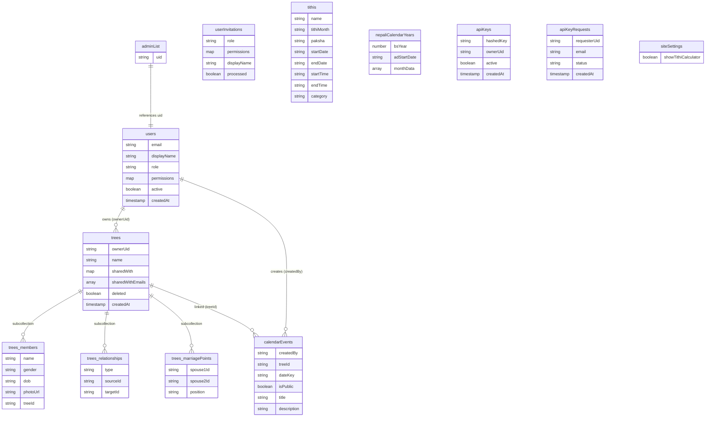

### Key Firestore Indexes

| Collection | Indexed Fields | Purpose |
|---|---|---|
| `tithis` | `(startDate ASC, startTime ASC)` | Date-range tithi queries |
| `calendarEvents` | `(createdBy, dateKey)` | Personal events by date |
| `calendarEvents` | `(isPublic, dateKey)` | Public events by date |
| `calendarEvents` | `(treeId, dateKey)` | Tree-linked events by date |
| `homeCards` | `(published, order)` | Home page card ordering |

### Firestore Security Rules Summary

```
trees       → owner full access; sharedWith[email].permission governs read/edit for others
users       → self read/write; admin reads all
adminList   → admin write; authenticated read
tithis      → admin write; authenticated read
apiKeys     → admin write; owner read
calendarEvents → creator full access; public events readable by authenticated users
```

---

## 7. Authentication & Role-Based Access Control

### Sign-In Flow

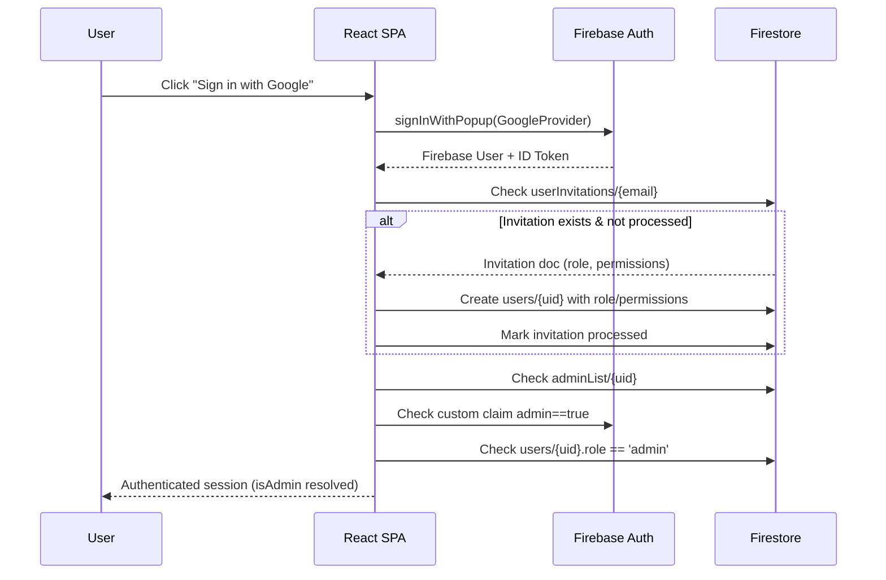

### Role Hierarchy & Permissions

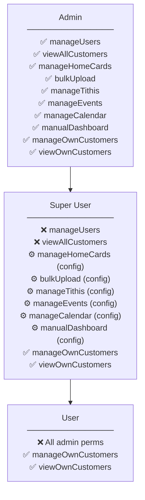

`⚙️ config` = permission granted or revoked individually by Admin per Super User account.

---

## 8. Tithi Calculation Pipeline

Tithis are Hindu lunar days, calculated from the angular difference between the Moon and Sun.

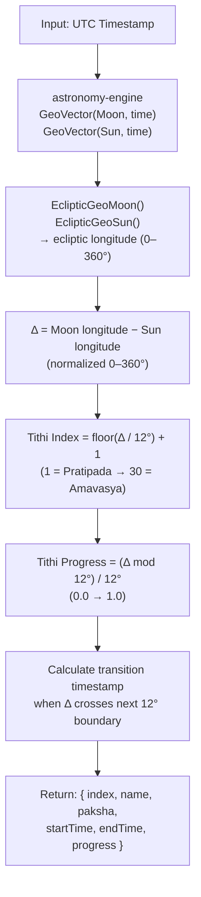

**Paksha (lunar fortnight):**
- Index 1–15 → **Shukla Paksha** (waxing moon)
- Index 16–30 → **Krishna Paksha** (waning moon)

---

## 9. Deployment Topology

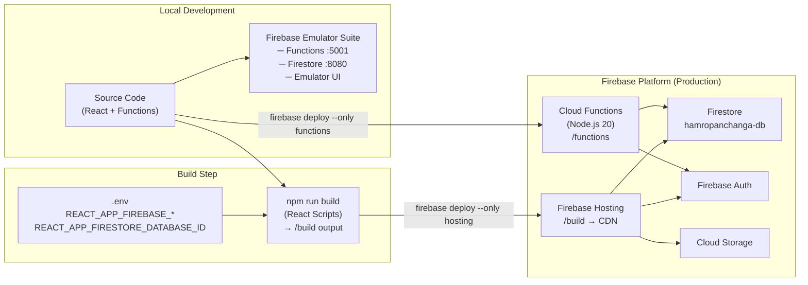

### Deploy Commands

```bash
# Build frontend
npm run build

# Deploy everything
firebase deploy

# Deploy only hosting (frontend)
firebase deploy --only hosting

# Deploy only Cloud Functions
firebase deploy --only functions

# Run locally with emulators
firebase emulators:start
```

---

## 10. Data Flow Diagrams

### Real-Time Family Tree Loading

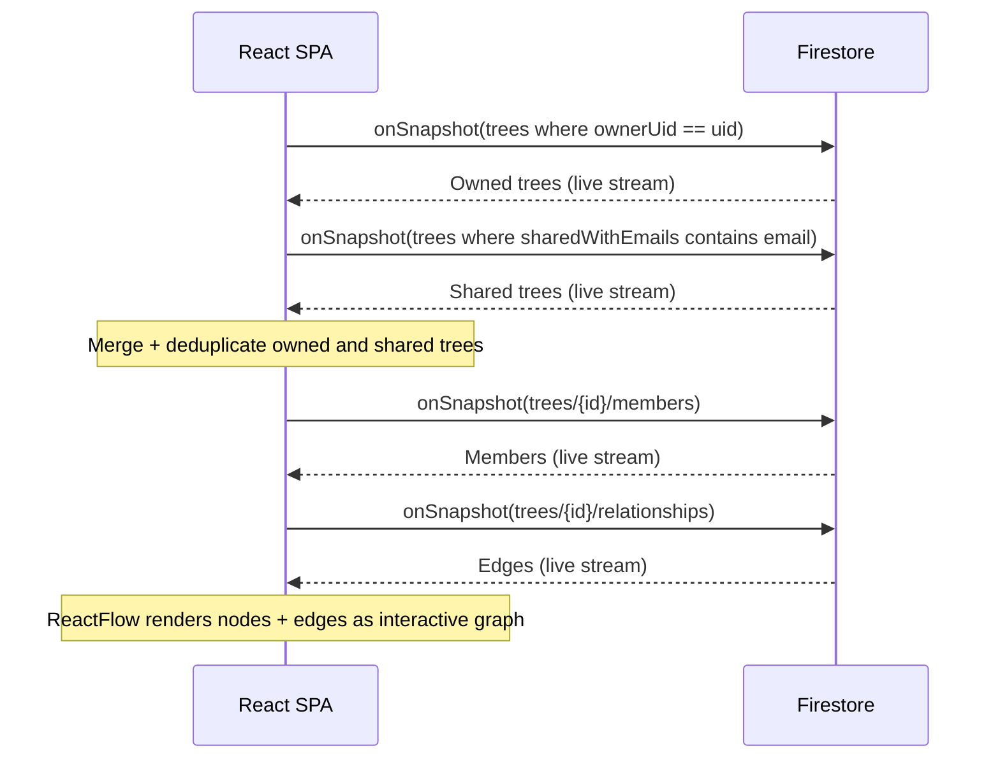

### Bulk Upload Flow

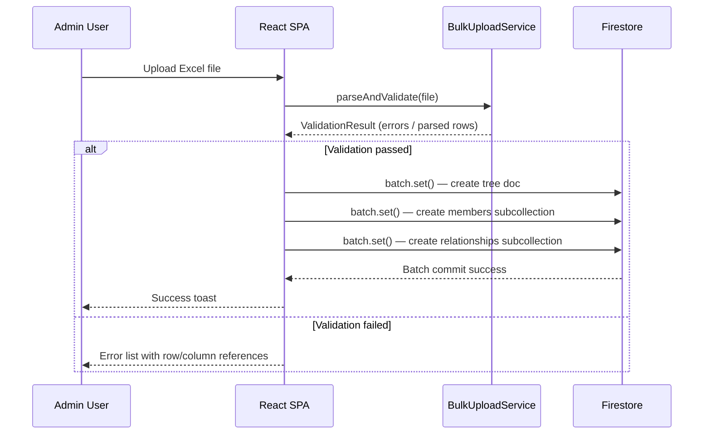

### Public API Request Flow

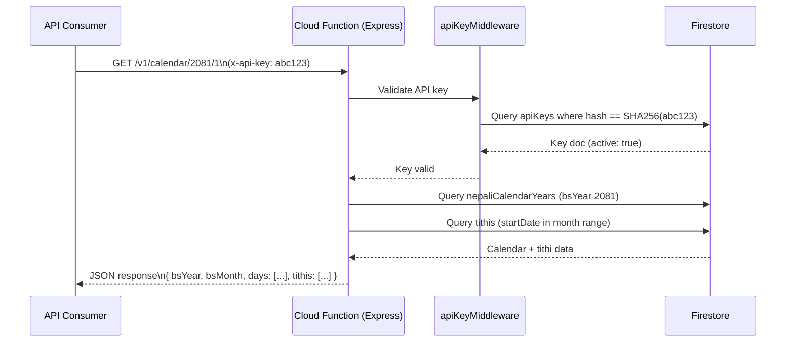

---

## Summary

| Layer | Technology |
|---|---|
| UI Framework | React 18 (Create React App) |
| Routing | React Router DOM v7 |
| Styling | Tailwind CSS + PostCSS |
| Graph Visualization | ReactFlow |
| State Management | React Context API (Auth + Language) |
| Database | Firebase Firestore (NoSQL) |
| Authentication | Firebase Auth — Google OAuth + custom claims |
| Backend | Firebase Cloud Functions (Express.js / Node.js 20) |
| File Storage | Firebase Cloud Storage |
| Hosting | Firebase Hosting (SPA) |
| Astronomical Engine | astronomy-engine (Moon/Sun positions) |
| Calendar System | Custom BS ↔ AD conversion engine |
| Internationalization | Custom Context-based i18n (EN / NE) |
| Excel I/O | xlsx library |
| Image Export | html-to-image |
